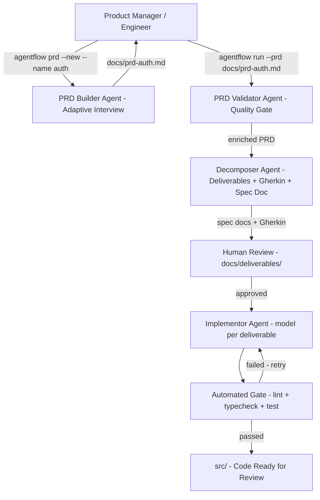
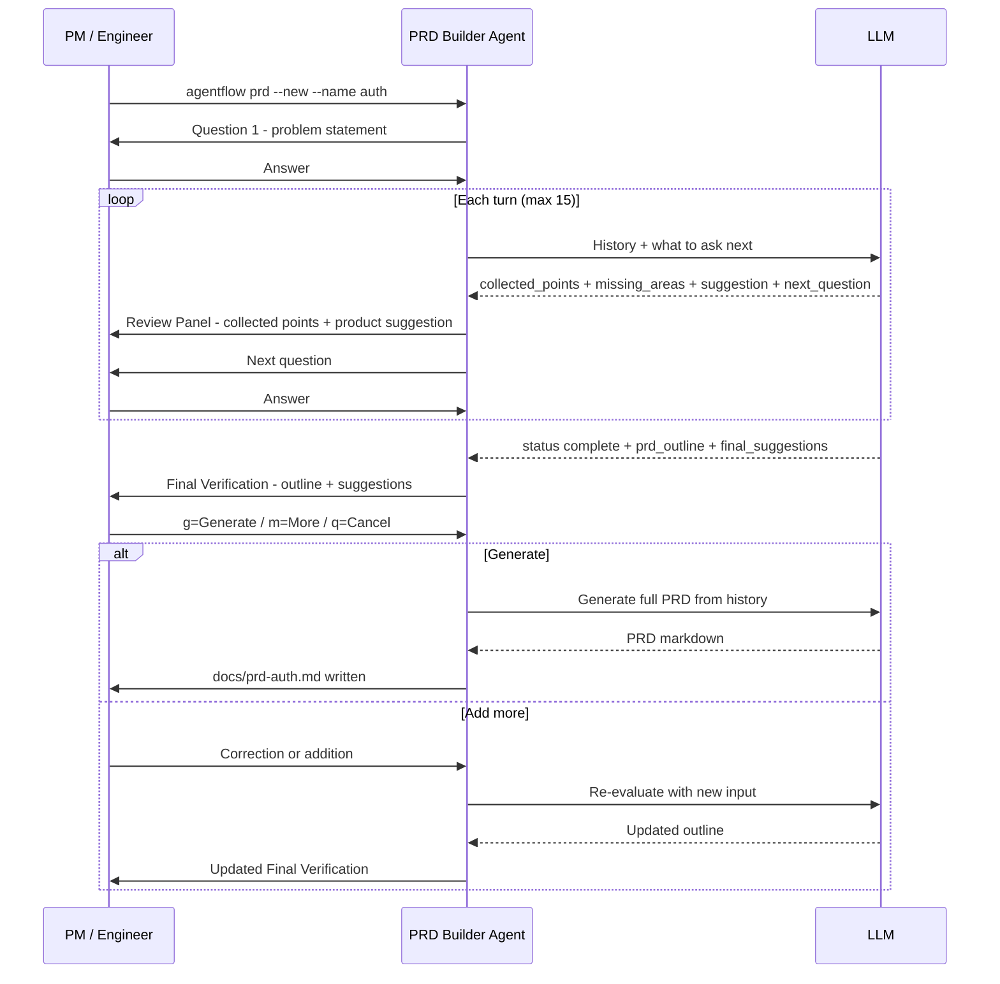
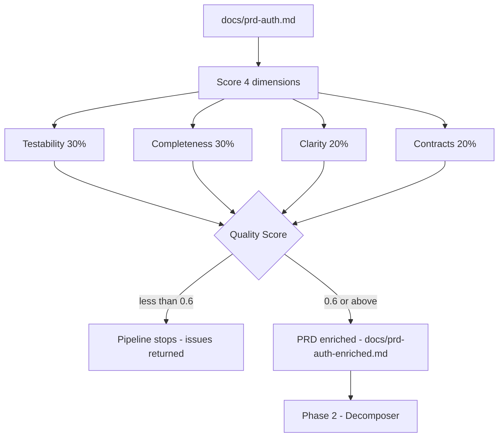
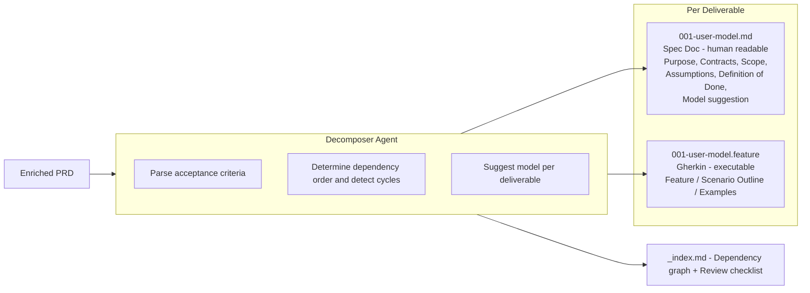
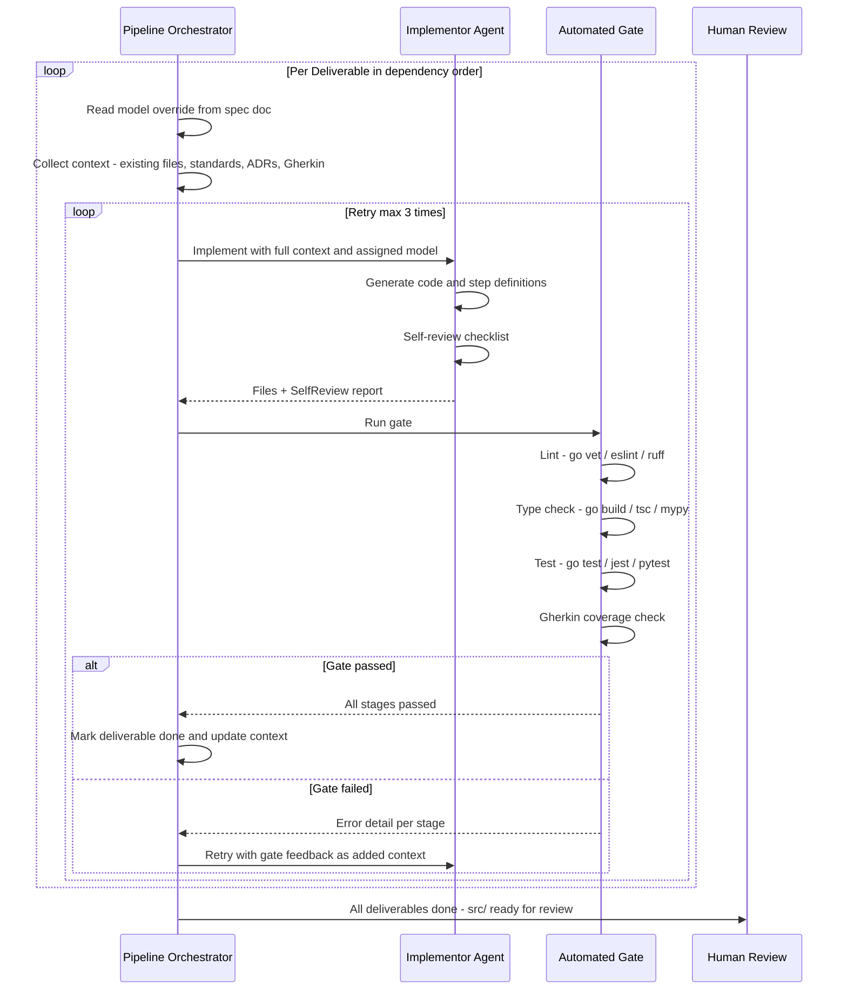
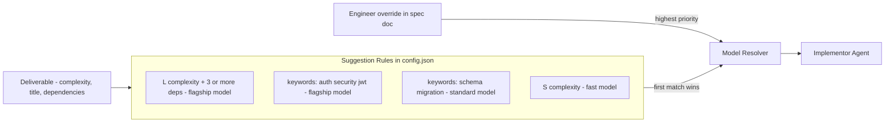
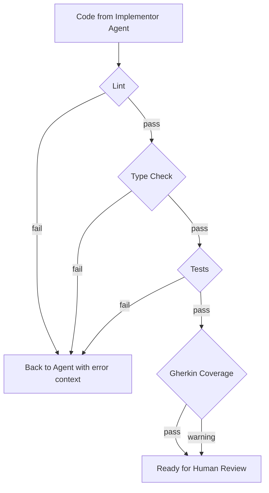
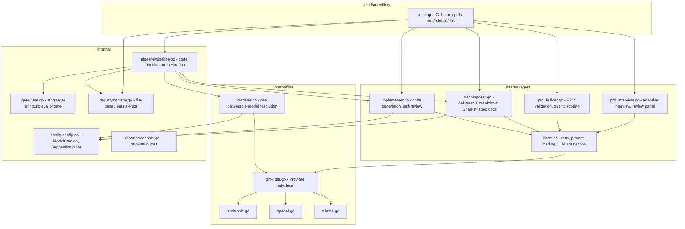
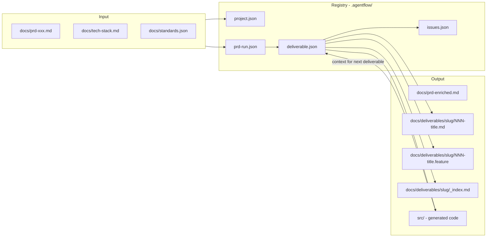

# agentflow

> **Agentic AI Development Pipeline** — from idea to production-ready code, with a methodology that maintains quality at every step.

agentflow is not just "AI that writes code." It is a **pipeline system** that governs how AI agents operate — from helping product managers write robust PRDs, decomposing them into deliverables with Gherkin specs, to implementing code with an automated quality gate.

Every phase is designed around one principle: **AI executes, the system maintains quality, humans direct.**

---

## Table of Contents

- [Philosophy](#philosophy)
- [Installation](#installation)
- [Overview](#overview)
- [Full Flow](#full-flow)
  - [Phase 0: PRD Builder — Adaptive Interview](#phase-0-prd-builder--adaptive-interview)
  - [Phase 1: PRD Validator](#phase-1-prd-validator)
  - [Phase 2: Decomposer Agent](#phase-2-decomposer-agent)
  - [Phase 3: Implementation Loop](#phase-3-implementation-loop)
- [Project Structure](#project-structure)
- [Usage](#usage)
- [Model Catalog & Token Management](#model-catalog--token-management)
- [Automated Gate](#automated-gate)
- [Configuration](#configuration)
- [Internal Architecture](#internal-architecture)
- [Command Reference](#command-reference)
- [Docker](#docker)
- [Contributing](#contributing)

---

## Philosophy

Most AI implementations in software development fail not because the AI is bad, but because there is no solid methodology behind it. AI without methodology is like a bulldozer without an operator — powerful, but destructive.

agentflow is built on five principles:

| Principle | Implementation |
|-----------|----------------|
| **Catch errors as early as possible** | Poor PRDs are rejected before decomposition; automated gate runs before human review |
| **The system maintains quality, not individuals** | Automated gate cannot be skipped; checklist per deliverable |
| **AI needs rich context** | Context builder injects existing codebase + standards + ADRs into every agent call |
| **Short loops beat big bang** | One deliverable → implement → gate → review → next |
| **Every issue is traced to its root** | Issues are categorised and logged for systemic feedback loops |

---

## Installation

### One-line install (macOS & Linux)

```bash
curl -fsSL https://raw.githubusercontent.com/namikazebadri/agentic-flow/main/install.sh | bash
```

The script will:
- Detect your OS and architecture (macOS/Linux, amd64/arm64)
- Download the pre-built binary for your platform
- Install binary → `/usr/local/bin/agentflow`
- Install prompts → `/usr/local/share/agentflow/prompts/`
- Create config → `~/.agentflow/config.json`
- Guide you through next steps

### Set Up API Key

After installation, set your API key:

```bash
# Anthropic (default)
export ANTHROPIC_API_KEY=sk-ant-...

# OpenAI
export OPENAI_API_KEY=sk-...

# Add to your shell config to persist across sessions
echo 'export ANTHROPIC_API_KEY=sk-ant-...' >> ~/.zshrc
```

To switch provider, edit `~/.agentflow/config.json`:

```json
{
  "active_provider": "openai"
}
```

> **Note:** `api_key_env` in `config.json` is the **name** of an environment variable (e.g. `ANTHROPIC_API_KEY`), never the key value itself. The installer writes the key to your shell config for you — you should never paste a secret into `config.json`.

### Install from Source

```bash
git clone <repo> agentflow-src
cd agentflow-src
make install
```

### Update

Re-run the same one-line install command — it pulls the latest release and replaces the binary and prompts in place:

```bash
curl -fsSL https://raw.githubusercontent.com/namikazebadri/agentic-flow/main/install.sh | bash
```

What happens on an upgrade:
- Binary at `/usr/local/bin/agentflow` is overwritten with the new version
- Prompts at `/usr/local/share/agentflow/prompts/` are overwritten
- `~/.agentflow/config.json` is **preserved** (your settings, model catalog, gate options)
- API key prompt is **skipped** if `ANTHROPIC_API_KEY` (or your active provider's env var) is already exported, or already present in your shell config — no duplicate export lines get appended

If installed from source, run `make install` again from an updated checkout.

### Uninstall

```bash
curl -fsSL https://raw.githubusercontent.com/namikazebadri/agentic-flow/main/install.sh | bash -s -- --uninstall
# or if installed from source:
make uninstall
```

---

## Overview



---

## Full Flow

### Phase 0: PRD Builder — Adaptive Interview

Invoked with `agentflow prd --new --name <feature>`. The agent acts as a senior product engineer interviewing the PM adaptively — each next question depends on the previous answer.



**What appears after every answer — the review panel:**

```
────────────────────────────────────────────────────
Review — collected so far:

  ✓ Problem        30% of support tickets are password resets
  ✓ Flow           Email link only, 15-minute expiry
  ~ Auth Method    Assumed JWT — not yet confirmed
  ? Rate Limiting  Not confirmed, likely needed

  Missing:
    · Error handling when link expires
    · Performance target

  [Security] — agent product suggestion
  Unregistered email returns 404 — exposes user enumeration.
  → Always return 200 with a generic message.
────────────────────────────────────────────────────
```

Legend: `✓ confirmed` · `~ inferred` · `? assumed (needs validation)`

**Final verification** before generation shows a per-section PRD outline and comprehensive suggestions grouped by severity:

- **MUST CONSIDER** — likely to cause serious problems if ignored
- **RECOMMENDED** — worth discussing before finalising  
- **OPTIONAL** — nice to have

---

### Phase 1: PRD Validator

After a PRD is written (manually or via interview), `agentflow run` validates its quality before decomposition.



A passing PRD is saved to the registry and its enriched version is written to `docs/prd-auth-enriched.md` — the PM can compare it against the original.

---

### Phase 2: Decomposer Agent

The decomposer breaks the PRD into ordered deliverables, each producing two output files.



The **dependency graph** in `_index.md` ensures implementation runs in the correct order:

```
[D-001] Database Schema Setup
└── [D-002] User Model
    ├── [D-003] Auth Module
    │   └── [D-004] Login Endpoint
    └── [D-005] Profile Service
        └── [D-006] Profile API Endpoints
```

**Human review checkpoint** — the engineer verifies `docs/deliverables/prd-auth/` before implementation begins. This is the one checkpoint that cannot be automated: ensuring the decomposition reflects business intent, not just the written spec.

---

### Phase 3: Implementation Loop

For each deliverable, the pipeline runs a tight loop with retry logic.



**Self-review checklist** — before submitting to the gate, the agent explicitly answers:

- Are all Gherkin scenarios satisfied?
- What assumptions were made that are not stated in the spec?
- Which parts are least certain?
- Is anything hardcoded that should come from config?

---

## Project Structure

```
my-project/
├── project.json                    ← agentflow project config
├── .agentflow/
│   └── registry/                   ← pipeline state (gitignored)
│       ├── project.json
│       ├── prd-runs/
│       │   └── {runID}/
│       │       ├── prd-run.json
│       │       └── deliverables/
│       │           └── {id}.json
│       ├── adr/
│       ├── standards.json
│       └── issues.json
│
├── docs/
│   ├── prd-auth.md                 ← PRD you wrote or generated
│   ├── prd-auth-enriched.md        ← PRD enriched by validator agent
│   ├── tech-stack.md
│   ├── standards.json
│   └── deliverables/
│       └── prd-auth/
│           ├── _index.md           ← dependency graph + review checklist
│           ├── 001-database-schema.md
│           ├── 001-database-schema.feature
│           ├── 002-user-model.md
│           ├── 002-user-model.feature
│           └── ...
│
└── src/                            ← generated code
    ├── handlers/
    ├── models/
    └── ...
```

All PRDs share one `src/` directory. The agent always reads existing files before implementing a new deliverable, ensuring consistency across sprints.

---

## Usage

### Full Flow for a New Feature

```bash
# 1. Create project
mkdir my-project && cd my-project
agentflow init

# 2. Write PRD via adaptive interview
agentflow prd --new --name auth
# Agent asks questions step by step
# Review panel appears after every answer with collected points and suggestions
# Final verification shown before generation
# → docs/prd-auth.md is written

# 3. Edit tech stack and standards (optional but recommended)
nano docs/tech-stack.md
nano docs/standards.json

# 4. Run the pipeline
agentflow run --prd docs/prd-auth.md
# Phase 1: PRD Validator  → quality score + enriched PRD
# Phase 2: Decomposer     → docs/deliverables/prd-auth/
# Phase 3: Implement loop → src/

# 5. Monitor progress
agentflow status
agentflow status --prd prd-auth
agentflow list
```

### Multi-PRD (Continuous Development)

Each PRD file produces an independent run with its own deliverables subfolder:

```bash
agentflow prd --new --name auth
agentflow run --prd docs/prd-auth.md

agentflow prd --new --name payment
agentflow run --prd docs/prd-payment.md

agentflow prd --new --name notification
agentflow run --prd docs/prd-notification.md
```

```
docs/deliverables/
├── prd-auth/
├── prd-payment/
└── prd-notification/
```

All sprints share the same `src/`. The agent reads existing code before implementing, so there is no duplication or conflict between sprints.

### Override Model per Deliverable

After decomposition, open a `*.md` file in `docs/deliverables/prd-auth/` and edit the `**Model**` line:

```markdown
**Model**: `claude-opus-4-6`

> Available models:
> - `claude-opus-4-7` — Claude Opus 4.7 [flagship/high]
> - `claude-opus-4-6` — Claude Opus 4.6 [flagship/high]
> - `claude-sonnet-4-6` — Claude Sonnet 4.6 [standard/medium]
> - `claude-haiku-4-5` — Claude Haiku 4.5 [fast/low]
```

agentflow reads the override before calling the implementor — no restart needed.

---

## Model Catalog & Token Management

agentflow automatically suggests a model per deliverable based on configurable suggestion rules. Engineers can override in the spec doc.



### Available Models

| Alias | Model | Tier | Cost | Best for |
|-------|-------|------|------|----------|
| `claude-opus-4-7` | Claude Opus 4.7 | flagship | high | Most complex deliverables |
| `claude-opus-4-6` | Claude Opus 4.6 | flagship | high | Security, auth, complex architecture |
| `claude-sonnet-4-6` | Claude Sonnet 4.6 | standard | medium | **Default** — most deliverables |
| `claude-haiku-4-5` | Claude Haiku 4.5 | fast | low | Simple CRUD, boilerplate |
| `gpt-4-5-high` | GPT-4.5 High | flagship | high | Complex reasoning (OpenAI) |
| `gpt-4-5-medium` | GPT-4.5 Medium | standard | medium | General code (OpenAI) |
| `gpt-codex-4-3` | GPT Codex 4.3 | code | medium | Pure code generation |

### Adding a New Model

Add to `~/.agentflow/config.json` without recompiling:

```json
{
  "models": {
    "models": {
      "my-new-model": {
        "alias": "my-new-model",
        "provider": "anthropic",
        "model_id": "claude-new-20260101",
        "display_name": "Claude New",
        "max_tokens": 8192,
        "tier": "standard",
        "cost_tier": "medium",
        "strengths": ["code generation", "APIs"],
        "notes": "Released Jan 2026"
      }
    },
    "suggestion_rules": [
      {
        "description": "API endpoints use new model",
        "conditions": {
          "has_keywords": ["endpoint", "api", "handler"],
          "complexity": "M"
        },
        "suggest_model": "my-new-model"
      }
    ]
  }
}
```

---

## Automated Gate

The gate runs automatically after every implementation. Humans should never review code that has not passed the gate first.



The gate auto-detects your tech stack:

| File detected | Lint | Type Check | Test |
|---------------|------|-----------|------|
| `go.mod` | `go vet ./...` | `go build ./...` | `go test -race ./...` |
| `tsconfig.json` | `eslint .` | `tsc --noEmit` | `npm test` |
| `package.json` | `eslint .` | — | `npm test` |
| `*.py` | `ruff check .` | `mypy .` | `pytest -v` |

Custom commands can be added in `config.json`:

```json
{ 
  "gate": {
    "custom_commands": [
      "staticcheck ./..."
    ]
  }
}
```

---

## Configuration

### `~/.agentflow/config.json` — global

```json
{
  "active_provider": "anthropic",
  "providers": { "": "..." },
  "models": {
    "models": { "": "..." },
    "suggestion_rules": [ "..." ]
  },
  "pipeline": {
    "max_retries": 3,
    "prompts_dir": "/usr/local/share/agentflow/prompts"
  },
  "gate": {
    "enable_lint": true,
    "enable_tests": true,
    "enable_type_check": true
  }
}
```

### `project.json` — per project

```json
{
  "name": "my-project",
  "prd_file": "docs/prd.md",
  "tech_stack_file": "docs/tech-stack.md",
  "standards_file": "docs/standards.json",
  "docs_dir": "docs",
  "src_dir": "src"
}
```

### Environment Variables

| Variable | Description |
|----------|-------------|
| `ANTHROPIC_API_KEY` | Anthropic API key |
| `OPENAI_API_KEY` | OpenAI API key |
| `OLLAMA_API_KEY` | Ollama placeholder (any value) |
| `AGENTFLOW_PROVIDER` | Override `active_provider` at runtime |
| `AGENTFLOW_VERBOSE` | Set `true` to print token usage |

---

## Internal Architecture



### Data Flow



---

## Command Reference

```bash
# Scaffold a new project
agentflow init [--name <name>]

# Adaptive PRD interview
agentflow prd --new --name <slug>
# example: agentflow prd --new --name user-authentication
# writes: docs/prd-user-authentication.md

# Run the pipeline
agentflow run [--prd <file>] [--config <path>] [--verbose] [--no-color]

# Monitor
agentflow status [--prd <slug|file>]
agentflow list

# Development
make build      # build binary to ./bin/
make install    # install system-wide
make uninstall  # remove from system
make test       # go test ./...
make lint       # go vet ./...
make help       # show all commands
```

---

## Docker

```bash
# Build image
make docker-build

# Run pipeline
docker-compose run agentflow run --prd /app/workspace/docs/prd-auth.md

# With Ollama (local LLM)
docker-compose --profile ollama up -d
AGENTFLOW_PROVIDER=ollama docker-compose run agentflow run \
  --prd /app/workspace/docs/prd-auth.md
```

---

## Contributing

The most effective ways to contribute:

1. **Improve prompts** — `prompts/*.md` requires no recompile. Tweak and test directly.
2. **Add models** — edit `~/.agentflow/config.json`, no recompile needed.
3. **Add gate stages** — extend `internal/gate/gate.go`.
4. **Add LLM providers** — implement the `llm.Provider` interface in `internal/llm/`.

---

*agentflow — AI executes, the system maintains quality, humans direct.*
